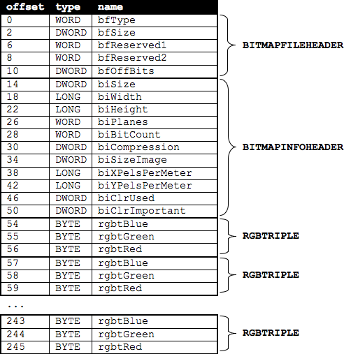

# whodunit
Recover "corrupted" .bmp files back to original version

The program takes a "corrupted" .bmp file and attempts to recover the original image by converting each 24-bit pixel in the image back to its original value.

### To run the program, compile whodunit.c and run it like so:

./whodunit <input_image.bmp> <output_image.bmp>

## Description of included files:

### bmp.h
Adapted from Microsoft's implementation of .bmp files. Organizes the array of bits from a file into sections unique to the .bmp file format. Something like this:

### whodunit.c
Program requires 2 command line arguments (input and output file names) from the user and reformats the input image file to remove the "noise" and convert it back to its original version.

#### Converts this:

#### Into this:

